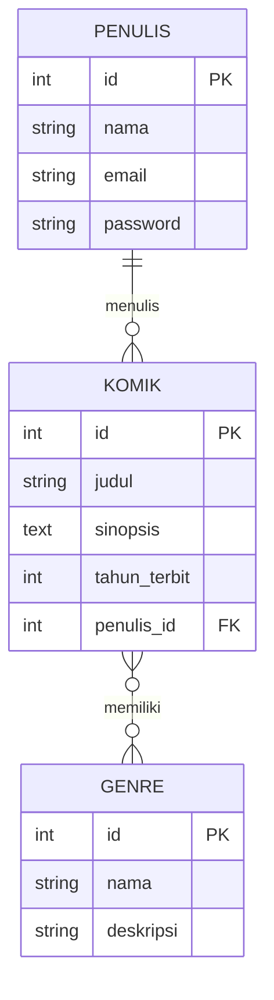

# 🚀 157_API_RELASI

**REST API pengelolaan komik** yang dibuat dengan **Node.js, Express, Sequelize, dan PostgreSQL**.

API ini digunakan untuk mengelola 3 data utama:
1. **Penulis** – orang yang menulis komik (sekaligus akun login)
2. **Komik** – data komik yang ditulis penulis
3. **Genre** – kategori komik (misal: Action, Comedy, Petualangan)

Keistimewaan API ini adalah **relasi antar tabel**:
- **One-to-Many**: satu penulis boleh menulis banyak komik
- **Many-to-Many**: satu komik boleh punya banyak genre, satu genre boleh dipakai banyak komik

Setiap request selain register/login **dilindungi token JWT**, dan password penulis di-hash dengan **bcrypt**.

---

## ✨ Fitur

- ✅ Registrasi akun penulis baru
- ✅ Login dan mendapatkan token JWT
- ✅ Menambah, melihat, mengubah, dan menghapus **genre**
- ✅ Menambah, melihat, mengubah, dan menghapus **komik**
- ✅ Komik otomatis terhubung dengan **penulis** dan **genre** saat ditampilkan
- ✅ Proteksi semua route dengan token JWT
- ✅ Password aman (di-hash dengan bcrypt, tidak disimpan mentah)
- ✅ Tabel database dibuat otomatis oleh Sequelize (fitur sync)

---

## 📸 Hasil Pengujian (Postman)

Berikut tangkapan layar hasil pengujian tiap endpoint (disimpan di folder `SS/`):

### 1. Register


### 2. Login


### 3. Buat Komik


### 4. Buat Genre


### 5. Lihat Daftar Komik


### 6. Update Komik + Genre


### 7. Hapus Komik


### 8. Lihat Daftar Genre


### 9. Update Genre


### 10. Hapus Genre


---

## 📦 Dependencies (Library yang Dipakai)

Semua library ini tercantum di file `package.json`. Berikut penjelasan **untuk apa** masing-masing dipakai:

| Library | Versi | Fungsi | Dipakai Untuk |
|---------|-------|--------|---------------|
| **express** | ^5.2.1 | Framework web Node.js | Membuat server, menerima request HTTP, dan mengatur route API |
| **sequelize** | ^6.37.8 | ORM (Object-Relational Mapping) | Berkomunikasi dengan database pakai JavaScript tanpa menulis SQL manual; mengelola tabel & relasi |
| **sequelize-cli** | ^6.6.5 | Alat baris perintah Sequelize | Menjalankan perintah seperti membuat migration/seeder (opsional) |
| **pg** | ^8.22.0 | Driver PostgreSQL | Penghubung antara Sequelize dan database PostgreSQL |
| **bcrypt** | ^6.0.0 | Library hashing password | Mengubah password jadi teks acak (hash) sebelum disimpan, supaya aman |
| **jsonwebtoken** | ^9.0.3 | Library JWT | Membuat token saat login dan memverifikasi token untuk setiap request yang dilindungi |
| **dotenv** | ^17.4.2 | Pembaca file `.env` | Memuat nilai rahasia (koneksi DB, JWT secret) dari file `.env` ke dalam aplikasi |
| **nodemon** | ^3.1.14 | Alat pengembangan | Otomatis me-restart server setiap ada perubahan kode, supaya tidak perlu start manual |

### Cara install semua sekaligus

```bash
npm install
```

### Penjelasan singkat istilah

- **ORM** = cara membaca/menulis database menggunakan objek JavaScript, bukan perintah SQL.
- **Hash** = mengubah teks biasa jadi kode acak satu arah; password asli tidak bisa dibaca dari hash.
- **JWT** = selembar "tiket" yang berisi data login dan masa berlaku, dipakai untuk membuktikan siapa pengirim request.

---

## 🔄 Cara Kerja Kode (Alur Request)

Pahami alur ini, supaya kamu tahu urutan eksekusi kode:

1. **Postman (klien)** mengirim request, contoh: `POST http://localhost:3000/api/komik`
2. **`index.js`** menerima request dan meneruskan ke `routes/api.js`
3. **`routes/api.js`** mencocokkan URL + method. Jika route butuh proteksi, request lewat dulu ke **`middleware/authMiddleware.js`** yang memverifikasi token JWT di header `Authorization`
4. Jika token valid, request masuk ke **controller** (misal `komikController.js`)
5. **Controller** memanggil **model** Sequelize untuk membaca/menulis **database**
6. **Database** mengembalikan data → controller menyusun respons JSON → dikirim kembali ke Postman

```
📤 Postman → index.js → routes/api.js → authMiddleware → controller → model → PostgreSQL
                                                                          ↘ respons JSON balik ke Postman
```

### Peran setiap file

| File | Peran |
|------|-------|
| `index.js` | Menyalakan server di port 3000 & menghubungkan database |
| `config/config.js` | Mengatur kredensial koneksi database dari `.env` |
| `config/db.js` | Fungsi konek + sinkronisasi tabel ke database |
| `routes/api.js` | Daftar semua endpoint dan pasangannya ke controller |
| `middleware/authMiddleware.js` | "Pintu pengaman": tolak request tanpa token / token rusak |
| `controller/*.js` | Logika bisnis: validasi data, CRUD, dan respons |
| `models/*.js` | Definisi tabel, kolom, dan relasi antar tabel |

---

## 📁 Struktur Folder

```
157_API_RELASI/
│
├── config/
│   ├── config.js           → Konfigurasi database (membaca .env)
│   └── db.js               → connectDatabase(): konek & auto-sync tabel
│
├── controller/
│   ├── genreController.js  → CRUD genre
│   ├── komikController.js  → CRUD komik + relasi penulis & genre
│   └── penulisController.js→ register & login
│
├── middleware/
│   └── authMiddleware.js   → Verifikasi token JWT
│
├── models/
│   ├── index.js            → Inisialisasi semua model + relasi (associate)
│   ├── penulis.js          → Model tabel `penulis`
│   ├── komik.js            → Model tabel `komik`
│   └── genre.js            → Model tabel `genre`
│
├── routes/
│   └── api.js              → Pendaftaran semua endpoint
│
├── migrations/             → (kosong, tempat migration Sequelize)
├── seeders/                → (kosong, tempat data awal)
│
├── index.js                → Entry point: menjalankan server
├── .sequelizerc            → Mengarahkan folder untuk Sequelize CLI
├── .env                    → Konfigurasi rahasia (TIDAK dibagikan)
└── package.json            → Dependencies & script
```

> **Kenapa ada `migrations/` dan `seeders/` kosong?** Karena proyek ini memakai `db.sequelize.sync()` di `config/db.js`, sehingga tabel dibuat otomatis saat server pertama kali jalan — tanpa perlu migration. Folder tersebut tetap disediakan untuk pengembangan lanjutan.

---

## ⚙️ Cara Menjalankan

### 1) Pastikan Prasyarat

- **Node.js** terinstall → cek dengan `node -v`
- **PostgreSQL** terinstall & berjalan (server database aktif)

### 2) Inisialisasi Node.js

Buka terminal di folder proyek, lalu jalankan perintah untuk membuat file `package.json`:

```bash
npm init -y
```

Parameter `-y` artinya menggunakan semua nilai default (tanpa ditanya-tanya).

### 3) Install Semua Dependencies

Jalankan perintah berikut untuk menginstall semua library yang dibutuhkan:

```bash
npm install express pg sequelize sequelize-cli dotenv nodemon jsonwebtoken bcrypt
```

Perintah ini akan mendownload dan menginstall **8 library sekaligus** ke folder `node_modules/`:

| Library | Kegunaan |
|---------|----------|
| express | Framework server & routing API |
| pg | Driver koneksi ke PostgreSQL |
| sequelize | ORM untuk mengelola database |
| sequelize-cli | Alat baris perintah Sequelize |
| dotenv | Membaca file `.env` |
| nodemon | Auto-restart server saat development |
| jsonwebtoken | Membuat & verifikasi token JWT |
| bcrypt | Hashing password |

> 💡 Jika kamu **meng-clone/menyalin proyek yang sudah jadi**, cukup jalankan `npm install` saja — otomatis membaca semua library dari `package.json` tanpa perlu menulis daftarnya manual.

### 4) Inisialisasi Sequelize

Jalankan perintah berikut untuk membuat struktur folder Sequelize secara otomatis (`config/`, `models/`, `migrations/`, `seeders/`):

```bash
npx sequelize init
```

### 5) Buat Database di PostgreSQL

Buka pgAdmin atau terminal PostgreSQL, lalu buat database:

```sql
CREATE DATABASE perpustakaan;
```

Contoh di psql:

```bash
psql -U postgres
# lalu ketik:
CREATE DATABASE perpustakaan;
```

### 6) Buat File `.env` di Root Folder

Buat file baru bernama `.env` di folder proyek (sejajar dengan `package.json`).
File ini memberi tahu aplikasi **cara menghubungi database** dan **kunci rahasia JWT**.

Variabel yang **harus ada** (isi sesuai punya kamu, contoh nilai di bawah hanya ilustrasi):

```
DB_USER=postgres
DB_PASS=password-mu
DB_DATABASE=perpustakaan
DB_HOST=127.0.0.1
DB_PORT=5432
DB_DIALECT=postgres
JWT_SECRET=kata-kunci-rahasia-mu
JWT_EXPIRES_IN=1d
```

| Variabel | Isi Dengan |
|----------|------------|
| DB_USER | Username PostgreSQL kamu |
| DB_PASS | Password PostgreSQL kamu |
| DB_DATABASE | Nama database (contoh: `perpustakaan`) |
| DB_HOST | Alamat database (local: `127.0.0.1`) |
| DB_PORT | Port PostgreSQL (default `5432`) |
| DB_DIALECT | Jenis database (`postgres`) |
| JWT_SECRET | Kunci rahasia bebas untuk menandatangani token |
| JWT_EXPIRES_IN | Masa berlaku token (contoh `1d` = 1 hari, `2h` = 2 jam) |

> ⚠️ **SANGAT PENTING:** file `.env` berisi password & kunci rahasia.
> Jangan pernah commit / bagikan isinya. File ini sudah ada di `.gitignore`,
> artinya tidak akan ikut ter-upload ke Git.

### 7) Jalankan Server

```bash
npm start
```

Hasil yang diharapkan di terminal:

```
Server is running on http://localhost:3000
Database connected successfully
Database synchronized
```

Saat `Database synchronized` muncul, artinya Sequelize sudah **membuat tabel secara otomatis**
(`penulis`, `komik`, `genre`, `komik_genre`) di database `perpustakaan`.

### 8) Coba Akses

Buka browser atau Postman, arahkan ke `http://localhost:3000/api/...`
(panduan lengkap ada di bagian Pengujian Postman di bawah).

---

## 🗄️ Struktur Database & Relasi

### Diagram ERD (Entity Relationship Diagram)



> Diagram ini render otomatis sebagai gambar di GitHub. Simbol `||--o{` berarti **one-to-many**,
> `}o--o{` berarti **many-to-many**, `PK` = Primary Key, `FK` = Foreign Key.

### A. Tabel `penulis`

Menyimpan data penulis (orang yang menulis komik + akun login).

| Kolom | Tipe Data | Aturan | Keterangan |
|-------|-----------|--------|------------|
| id | INTEGER | Primary Key, auto increment | Nomor unik penulis (1, 2, 3, ...) |
| nama | STRING | NOT NULL (wajib) | Nama penulis |
| email | STRING | NOT NULL, UNIQUE | Email login, tidak boleh sama antar penulis |
| password | STRING | NOT NULL | Password yang sudah di-hash bcrypt |
| createdAt | DATE | Otomatis | Waktu data dibuat |
| updatedAt | DATE | Otomatis | Waktu data terakhir diubah |

**Contoh data:**

| id | nama | email | password |
|----|------|-------|----------|
| 1 | Budi Santoso | budi@mail.com | $2b$10$JvKx... (hash acak) |

### B. Tabel `komik`

Menyimpan data komik. Setiap komik pasti milik satu penulis.

| Kolom | Tipe Data | Aturan | Keterangan |
|-------|-----------|--------|------------|
| id | INTEGER | Primary Key, auto increment | Nomor unik komik |
| judul | STRING | NOT NULL | Judul komik |
| sinopsis | TEXT | NOT NULL | Ringkasan cerita |
| tahun_terbit | INTEGER | NOT NULL | Tahun terbit (contoh: 1997) |
| penulis_id | INTEGER | NOT NULL, **Foreign Key → penulis.id** | Penulis yang membuat komik ini |
| createdAt | DATE | Otomatis | Waktu dibuat |
| updatedAt | DATE | Otomatis | Waktu diubah |

**Contoh data:**

| id | judul | sinopsis | tahun_terbit | penulis_id |
|----|-------|----------|--------------|------------|
| 1 | One Piece | Petualangan bajak laut | 1997 | 1 |

### C. Tabel `genre`

Menyimpan kategori komik (Action, Comedy, dll).

| Kolom | Tipe Data | Aturan | Keterangan |
|-------|-----------|--------|------------|
| id | INTEGER | Primary Key, auto increment | Nomor unik genre |
| nama | STRING | NOT NULL, UNIQUE | Nama genre |
| deskripsi | TEXT | Boleh kosong | Penjelasan genre |
| createdAt | DATE | Otomatis | Waktu dibuat |
| updatedAt | DATE | Otomatis | Waktu diubah |

### D. Tabel `komik_genre` (tabel penghubung, dibuat otomatis oleh Sequelize)

Tabel ini jembatan relasi **many-to-many** antara komik dan genre.

| Kolom | Tipe | Keterangan |
|-------|------|------------|
| komik_id | INTEGER | Foreign Key → `komik.id` |
| genre_id | INTEGER | Foreign Key → `genre.id` |

**Contoh:** komik id 1 punya genre 1 (Action) dan genre 2 (Comedy):

| komik_id | genre_id |
|----------|----------|
| 1 | 1 |
| 1 | 2 |

### Penjelasan Relasi

1. **Penulis → Komik (One-to-Many / 1 penulis — N komik)**
   - Satu penulis bisa menulis **banyak komik**.
   - Satu komik hanya dimiliki **satu penulis**.
   - Dibuat lewat kolom `komik.penulis_id` yang menunjuk ke `penulis.id`.
   - Di kode: `Penulis.hasMany(Komik)` dan `Komik.belongsTo(Penulis)` (lihat `models/penulis.js` & `models/komik.js`).

2. **Komik ↔ Genre (Many-to-Many / N komik — M genre)**
   - Satu komik bisa punya **banyak genre**.
   - Satu genre bisa dipakai oleh **banyak komik**.
   - Dibuat lewat tabel perantara `komik_genre`.
   - Di kode: `Komik.belongsToMany(Genre, { through: 'komik_genre' })` dan sebaliknya di `models/genre.js`.

> 💡 **Cara baca kode relasi di model:**
> - `hasMany` / `belongsTo` → relasi satu-ke-banyak (One-to-Many)
> - `belongsToMany(..., through: 'nama_tabel')` → relasi banyak-ke-banyak (Many-to-Many)

---

## 🌐 Daftar Endpoint API

Semua URL diawali dengan `http://localhost:3000`.

| # | Method | Endpoint | Butuh Token? | Deskripsi |
|---|--------|----------|--------------|-----------|
| 1 | POST | `/api/register` | ❌ Tidak | Registrasi akun penulis baru |
| 2 | POST | `/api/login` | ❌ Tidak | Login & mendapatkan token JWT |
| 3 | GET | `/api/genre` | ✅ Ya | Ambil semua genre |
| 4 | POST | `/api/genre` | ✅ Ya | Tambah genre baru |
| 5 | PUT | `/api/genre/:id` | ✅ Ya | Ubah genre sesuai id |
| 6 | DELETE | `/api/genre/:id` | ✅ Ya | Hapus genre sesuai id |
| 7 | GET | `/api/komik` | ✅ Ya | Ambil semua komik (+ penulis & genre) |
| 8 | POST | `/api/komik` | ✅ Ya | Tambah komik baru |
| 9 | PUT | `/api/komik/:id` | ✅ Ya | Ubah komik sesuai id |
| 10 | DELETE | `/api/komik/:id` | ✅ Ya | Hapus komik sesuai id |

> `:id` artinya diganti angka, contoh: `PUT /api/komik/1` artinya mengubah komik dengan id 1.

---

## 🧪 Pengujian dengan Postman (Step by Step)

### Persiapan di Postman

1. Buka Postman, klik tombol **+** (New Request).
2. Pastikan server berjalan (`npm start`).
3. Untuk request yang butuh token (bertanda 🔒), tambahkan header:
   ```
   Authorization: Bearer <token>
   ```
   (token didapat dari Langkah 2).
4. Body JSON: klik tab **Body** → pilih **raw** → ubah dropdown kiri dari *Text* menjadi **JSON**.

---

### Langkah 1 — Register (Buat Akun Penulis)

- **Method:** `POST`
- **URL:** `http://localhost:3000/api/register`
- **Body (raw / JSON):**

```json
{
    "nama": "Budi Santoso",
    "email": "budi@mail.com",
    "password": "rahasia123"
}
```

- **Hasil sukses (201):**

```json
{
    "message": "Registrasi berhasil.",
    "data": {
        "id": 1,
        "nama": "Budi Santoso",
        "email": "budi@mail.com"
    }
}
```

- ✅ **Catat `id` (1)** → dipakai sebagai `penulis_id` di langkah 3.

### Langkah 2 — Login (Dapatkan Token)

- **Method:** `POST`
- **URL:** `http://localhost:3000/api/login`
- **Body (raw / JSON):**

```json
{
    "email": "budi@mail.com",
    "password": "rahasia123"
}
```

- **Hasil sukses (200):**

```json
{
    "message": "Login berhasil.",
    "token": "eyJhbGciOiJIUzI1NiIs..."
}
```

- ✅ **Salin token** → pakai untuk semua langkah berikutnya.
  💡 Tips: di tab **Tests** tulis `pm.environment.set("token", pm.response.json().token);`,
  lalu pakai `{{token}}` di header supaya otomatis.

### Langkah 3 — Buat Komik 🔒

- **Method:** `POST`
- **URL:** `http://localhost:3000/api/komik`
- **Header:** `Authorization: Bearer <token>`
- **Body (raw / JSON):**

```json
{
    "judul": "One Piece",
    "sinopsis": "Petualangan bajak laut mencari harta karun.",
    "tahun_terbit": 1997,
    "penulis_id": 1
}
```

- **Hasil sukses (201):** `{ "message": "Komik berhasil ditambahkan.", "data": { "id": 1, ... } }`
- ✅ Catat **id komik** untuk langkah 6 & 7.

### Langkah 4 — Buat Genre 🔒

- **Method:** `POST`
- **URL:** `http://localhost:3000/api/genre`
- **Header:** `Authorization: Bearer <token>`
- **Body (raw / JSON):**

```json
{
    "nama": "Petualangan",
    "deskripsi": "Cerita dengan nuansa petualangan seru."
}
```

- **Hasil sukses (201):** `{ "message": "Genre berhasil ditambahkan.", "data": { "id": 1, ... } }`
- ✅ Catat **id genre** untuk langkah 6.

### Langkah 5 — Lihat Semua Komik 🔒

- **Method:** `GET`
- **URL:** `http://localhost:3000/api/komik`
- **Header:** `Authorization: Bearer <token>`
- **Hasil sukses (200):** array komik. Perhatikan respons berisi **`penulis`** (data penulis) dan **`genre`** (saat ini masih `[]` karena belum dihubungkan).

### Langkah 6 — Ubah Komik + Hubungkan Genre 🔒 (ujian relasi many-to-many)

- **Method:** `PUT`
- **URL:** `http://localhost:3000/api/komik/1` (ganti `1` dengan id komik)
- **Header:** `Authorization: Bearer <token>`
- **Body (raw / JSON):**

```json
{
    "judul": "One Piece (Edisi Revisi)",
    "sinopsis": "Petualangan bajak laut mencari harta karun.",
    "tahun_terbit": 1997,
    "penulis_id": 1,
    "genre_ids": [1]
}
```

- **Hasil sukses (200):** `{ "message": "Komik berhasil diperbarui.", "data": { ... } }`
- ✅ **Periksa:** di bagian `genre` kini berisi data genre id 1 → relasi many-to-many berhasil.

### Langkah 7 — Hapus Komik 🔒

- **Method:** `DELETE`
- **URL:** `http://localhost:3000/api/komik/1` (ganti `1` dengan id komik)
- **Header:** `Authorization: Bearer <token>`
- **Hasil sukses (200):** `{ "message": "Komik berhasil dihapus." }`
- ⚠️ **Urutan penting:** komik harus dihapus **sebelum** genre (lihat langkah 10).

### Langkah 8 — Lihat Semua Genre 🔒

- **Method:** `GET`
- **URL:** `http://localhost:3000/api/genre`
- **Header:** `Authorization: Bearer <token>`
- **Hasil sukses (200):** array genre.

### Langkah 9 — Ubah Genre 🔒

- **Method:** `PUT`
- **URL:** `http://localhost:3000/api/genre/1` (ganti `1` dengan id genre)
- **Header:** `Authorization: Bearer <token>`
- **Body (raw / JSON):**

```json
{
    "nama": "Action",
    "deskripsi": "Penuh aksi dan pertarungan."
}
```

- **Hasil sukses (200):** `{ "message": "Genre berhasil diperbarui.", "data": { ... } }`

### Langkah 10 — Hapus Genre 🔒

- **Method:** `DELETE`
- **URL:** `http://localhost:3000/api/genre/1` (ganti `1` dengan id genre)
- **Header:** `Authorization: Bearer <token>`
- **Hasil sukses (200):** `{ "message": "Genre berhasil dihapus." }`
- ✅ Aman, karena komik sudah dihapus di langkah 7. Jika komik masih terhubung, API akan menolak dengan pesan `Genre masih digunakan oleh komik`.

---

## ✅ Checklist Hasil Pengujian

| No | Endpoint | Status |
|----|----------|--------|
| 1 | POST `/api/register` | ☐ |
| 2 | POST `/api/login` | ☐ |
| 3 | POST `/api/komik` | ☐ |
| 4 | POST `/api/genre` | ☐ |
| 5 | GET `/api/komik` | ☐ |
| 6 | PUT `/api/komik/:id` | ☐ |
| 7 | DELETE `/api/komik/:id` | ☐ |
| 8 | GET `/api/genre` | ☐ |
| 9 | PUT `/api/genre/:id` | ☐ |
| 10 | DELETE `/api/genre/:id` | ☐ |

---

## ⚠️ Error Umum & Cara Mengatasinya

| Masalah | Penyebab | Solusi |
|---------|----------|--------|
| `Database connection failed` | Kredensial `.env` salah / PostgreSQL mati | Cek `.env`, pastikan PostgreSQL berjalan |
| `401 Authorization token tidak ditemukan` | Tidak kirim header Authorization | Tambahkan `Authorization: Bearer <token>` |
| `401 token tidak valid` | Token salah / kadaluarsa | Login ulang untuk token baru |
| `400 Genre masih digunakan oleh komik` | Menghapus genre yang masih terhubung komik | Hapus komiknya dulu, baru hapus genre |
| Port 3000 sudah terpakai | Server lain sedang jalan | Ubah port di `index.js` atau tutup aplikasi lain |

### Pertanyaan Umum (FAQ)

**Q: Kenapa tabel langsung dibuat tanpa migration?**
A: Proyek memakai `db.sequelize.sync({ alter: true })` di `config/db.js`, yang otomatis membuat/menyesuaikan tabel sesuai model saat server dijalankan.

**Q: Apakah password tersimpan aman?**
A: Ya. Password di-hash dengan bcrypt (`bcrypt.hash(password, 10)`) sebelum disimpan, jadi tidak tersimpan sebagai teks asli.
